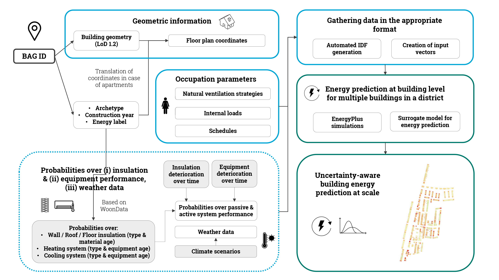

# A Repository for building-level energy assessment at scale considering material, equipment & weather uncertainties

This repository contains the codes referring to the paper "Decision support system for urban energy retrofit planning under uncertainties". The code provides building-level assessments of energy demand for many buildings at a time considering material and equipment performance and weather data under different scenarios. The final outcome are plots with heating and cooling demand at building and district level with different probabilities. 


Connecting to open-source GIS data, the extraction of building geometry is automated, whereas the connection to probabilities from WoonData provides realistic estimation of properties given the archetype and label of the building. The scripts are adjusted for Rotterdam (the Netherlands) and can also be used for other cities in the same country. ++ description of main workflow



For more information, please refer to the [paper]().

## Installation 

### 1. Create the virtual environment

### 2. Install the dependencies

### 3. (optional) Test the installation

### 4. Install EnergyPlus v.23-2-0 

## Structure
The scripts are made to be able to run fast energy assessments at scale so that the potential at district level can be assessed. There is one alternative which is to automatically generate the IDF files and run EnergyPlus in batches and another one which is to use a surrogate model that is trained based on synthetic data produced by EnergyPlus simulations. 

## Code

Below you can find the directory structure along with a short explanation of the files:

```
Energy_prediction_scale
├── README.md
├── building_class:
|   ├── building_class.py initiate the building class
|   ├── getdata_functions_building.py: extract building level data (Nieman database & open-source BAG data)
|   ├── getdata_functions_apartment.py: modify geometric data in the case of an apartment
|   ├── create_idf_file.py: initiate the idf file
|   ├── modify_idf_for_simulation.py: apply Energyplus properties 
|   ├── get_retrofit_data.py: Modify material & equipment information according to the retrofits
├── dbn:
|   ├── woon_functions.py: Functions to assign material & equipment properties based on probablities from WoonData
|   ├── degradation_over_years.py: Functions to modify material & equipment properties according to long-term degradation
|   ├── climate_change.py: Functions to assign weather data according to climate change probabilities
|   ├── run_energyplus.py: Building energy assessment using EnergyPlus
|   ├── run_nn: Building energy assessment via NN
├── run_simulations_batches:
|   ├── run_energyplus_batch.py: Batch energy assessment using parallel processing in EnergyPlus
|   ├── run_nn_batch.py: Batch energy assessment via NN
├── decision_support:
|   ├── visualize_data.py: script to visualize the results at neighborhood level
├── files:
|   ├── nieman_data.csv: Database with detailed information per building in Rotterdam
|   ├── initial_woon_probs.npz: Probabilities of having insulation & equipment type given the archetype, construction year and energy label
|   ├── transitions.npz: Time-dependent transition probabilities (insulation & equipment efficiency)
|   ├── retrofits.csv: Possible retrofit options
|   ├── action_costs.csv: Costs associated with each retrofit
|   ├── blocks_kralingseveer.csv: BAG IDs belonging to each building block in Kralingseveer
|   ├── kralingseveer.shp: Shape file containing the building boundaries for Kralingseveer neighborhood
|   ├── bags_training.csv: 10k BAG IDs randomly selected to produce synthetic data and use for training the NN
|   ├── weather_data:
    |   ├── TMY_file.epw: Typical Meteorological Year file referring to weather data from the period 2009-2023 in Rotterdam, NL
    |   ├── SSP345_file.epw: Morphed TMY file corresponding to SSP scenario 3-4.5
    |   ├── SSP585_file.epw: Morphed TMY file corresponding to SSP scenario 5-8.5
```

## How to run the energy assessment
The main input is the BAG Adres ID which can be retrieved for each building address from https://bagviewer.kadaster.nl/lvbag/bag-viewer. (Enter the address and get the BAG Address)

Check that the archetype is available - if not, enter manually

Choose retrofit option / available retrofits from TABULA database


## Results (Decision support for retrofit planning)

Here we show some characteristic plots using the decision support system.

## Training

Here we show the basic characteristics related to training and the most important features/outcome of the database.

## Acknowledgements 
We used eppy and geomeppy python libraries. The repository is inspired by. + BAG data + future weather generator + Woondata
The work was produced within the framework of DE-CIST project funded by the ICLEI Action Fund and Multicare project.

## Citation
The source code in this repository is released under the MIT License. If you would like to refer to our work, please consider citing:

```
@article{
}
```


