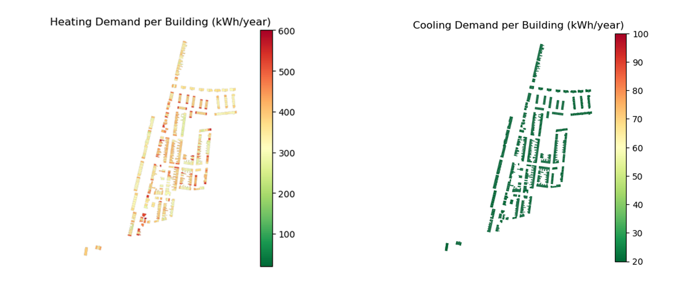
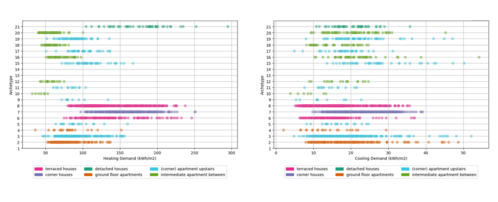
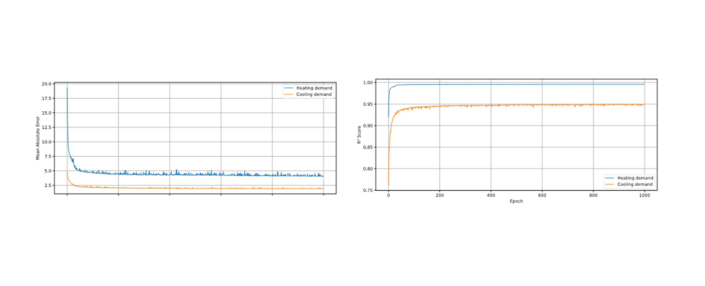

# A repository for building-level energy assessment at scale considering material, equipment & weather uncertainties

This repository contains the codes referring to the paper "Decision support system for urban energy retrofit planning under uncertainties". The code provides building-level assessment of energy demand for multiple buildings at a time considering uncertainties related to material and equipment performance and weather data under different scenarios. The final plots display the distribution over possible energy demand per building as well as aggregated results at district level. 

## Overview 
++ description of main workflow ++


For more information, please refer to the [paper]().

## Installation 

### 1. Install EnergyPlus v.23-2-0 

In case you want to perform the energy assessment using Energyplus, you must have downloaded and installed the application from [https://github.com/NREL/EnergyPlus/releases/tag/v23.2.0](https://github.com/NREL/EnergyPlus/releases/tag/v23.2.0).

### 2. Create the virtual environment

```
conda create --name energy_prediction_scale_env -y python==3.9
conda activate energy_prediction_scale_env
```
### 3. Install the dependencies

### 4. (optional) Test the installation

## Code

Below you can find the directory structure along with a short explanation of the files:

```
Energy_prediction_scale
├── README.md
├── building_class:
|   ├── building_class.py initiate the building class
|   ├── getdata_functions_building.py: extract building level data (Nieman database & open-source BAG data)
|   ├── getdata_functions_apartment.py: modify geometric data in the case of an apartment
|   ├── create_idf_file.py: initiate the idf file
|   ├── modify_idf_for_simulation.py: apply Energyplus properties 
|   ├── get_retrofit_data.py: Modify material & equipment information according to the retrofits
├── dbn:
|   ├── woon_functions.py: Functions to assign material & equipment properties based on probablities from WoonData
|   ├── degradation_over_years.py: Functions to modify material & equipment properties according to long-term degradation
|   ├── climate_change.py: Functions to assign weather data according to climate change probabilities
|   ├── run_energyplus.py: Building energy assessment using EnergyPlus
|   ├── run_nn.py: Building energy assessment via NN
├── run_simulations_batches:
|   ├── run_energyplus_batch.py: Batch energy assessment using parallel processing in EnergyPlus
|   ├── run_nn_batch.py: Batch energy assessment via NN
├── decision_support:
|   ├── visualize_data.py: script to visualize the results at neighborhood level
├── files:
|   ├── nieman_data.csv: Database with detailed information per building in Rotterdam
|   ├── initial_woon_probs.npz: Probabilities of having insulation & equipment type given the archetype, construction year and energy label
|   ├── transitions.npz: Time-dependent transition probabilities (insulation & equipment efficiency)
|   ├── retrofits.csv: Possible retrofit options
|   ├── action_costs.csv: Costs associated with each retrofit
|   ├── blocks_kralingseveer.csv: BAG IDs belonging to each building block in Kralingseveer
|   ├── kralingseveer.shp: Shape file containing the building boundaries for Kralingseveer neighborhood
|   ├── bags_training.csv: 10k BAG IDs randomly selected to produce synthetic data and use for training the NN
|   ├── template.idf: Empty idf template
├── run_surrogate_files:
|   ├── one_hot_encoder_archetype.joblib
|   ├── surrogate_heating_cooling_pth
|   ├── input_scaler.pkl
|   ├── output_scaler.pkl
├── epw_file:
    ├── TMY_file.epw: Typical Meteorological Year file referring to weather data from the period 2009-2023 in Rotterdam, NL
    ├── SSP345_file.epw: Morphed TMY file corresponding to SSP scenario 3-4.5
    ├── SSP585_file.epw: Morphed TMY file corresponding to SSP scenario 5-8.5
```

## How to run the energy assessment

The two main files to perform the energy assessment are:
- `run_energyplus.py`: Building energy assessment using EnergyPlus
- `run_nn.py`: Building energy assessment via NN

Upon opening the file, the user is asked to provide the BAG Adres ID which can be retrieved for each building address from https://bagviewer.kadaster.nl/lvbag/bag-viewer. If the archetype and construction year for the given BAG ID are not available in the databases, then the user will be asked to provide them manually. If the energy label is not available, then the initial material properties and equipment availability will be assigned based on the total probability mass over all energy labels for a given archetype and construction year. The user is also asked to provide a retrofit action (do-nothing or specific retrofit packeage). The EnergyPlus code can be used for small number of simulations, since it provides estimations with higher fidelity but in the expense of larger computational time. In contrast, the neural network provides faster assessments and can be used in combination with optimization algorithms to identify effective retrofit strategies at neighborhood level.

## Results (Decision support for retrofit planning)

The final outcome is a map of heating and cooling demand per building at district level. Given the uncertainty ranges, the map does not provide only deterministic values but a distribution of possible energy outcomes as well as the probability that the whole neighborhood exceeds a specific energy target. This can then be used by policy makers to evaluate the outcome and the associated risk given different retrofit scenarios. Below there are characteristic plots based on different baselines. For detailed discussion of results, you can look at the [paper]().



## Training

The neural network is trained based on synthetic data produced by EnergyPlus using the batch energy assessment via parallel processing. 10k BAG IDs corresponding to all possible archetypes are randomly selected from the Rotterdam building stock. Different retrofit packages are created through sampling from uniform distributions corresponding to the possible ranges of material properties, infiltration, and equipment capacity and efficiency. The values of the basic input features and energy ranges are shown in the following image.



The neural network architecture consists of an input layer with 32 features, two hidden layers with 64 neurons each, and an output layer with two outputs. All layers are fully connected, and the hyperparameters are tuned using grid search.



## Acknowledgements 
The building energy performance simulations are conducted using [EnergyPlus](https://energyplus.net/) and the respective input data files (.idf) are generated using [Eppy](https://github.com/santoshphilip/eppy) and [GeomEppy](https://github.com/jamiebull1/geomeppy) Python libraries. The code is using data from Nieman report (provided by Gemeente Rotterdam) and open-source 3DBAG data (provided via). The probabilities of having specific material properties and equipment type are calculated based on data from the Woon database (provided by DANS institute). Lastly, the TMY data are extracted from climateonebuilding.org and are morphed according to future climate scenarios using the future weather generator from (Rodriguez et al., 2023). 

The repository is inspired by [AmsterTime](https://github.com/seyrankhademi/AmsterTime) and [jax-imprl](https://github.com/omniscientoctopus/jax-imprl).

This material is based upon work supported by the DE-CIST project under the ICLEI Action Fund, the MultiCare EU project (GA no. 101123467), and the TU Delft AI Labs program.

## Citation
The source code in this repository is released under the MIT License. If you would like to refer to our work, please consider citing:

```
@article{
}
```


